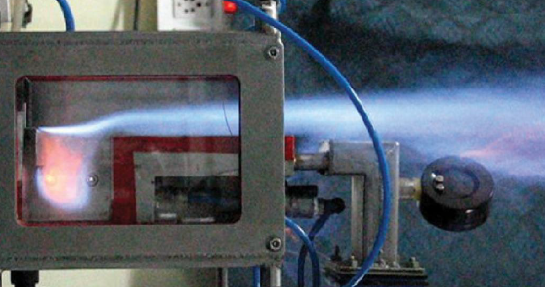
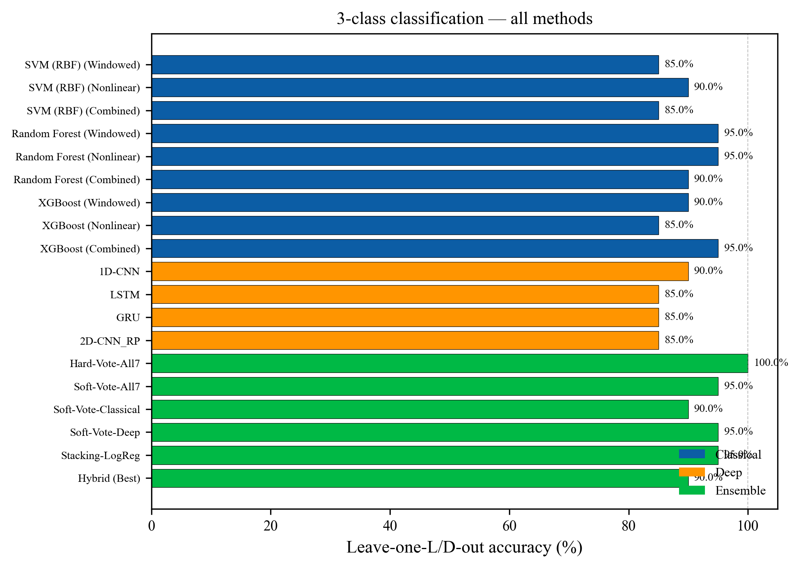
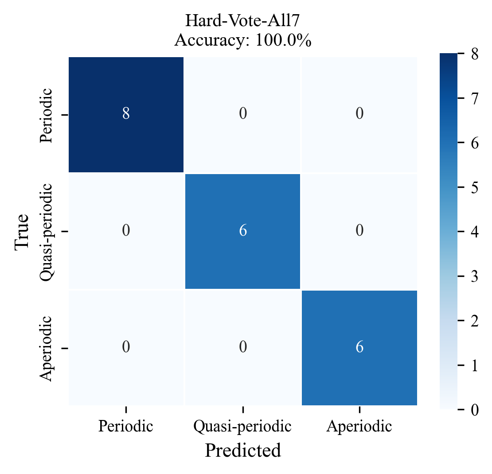
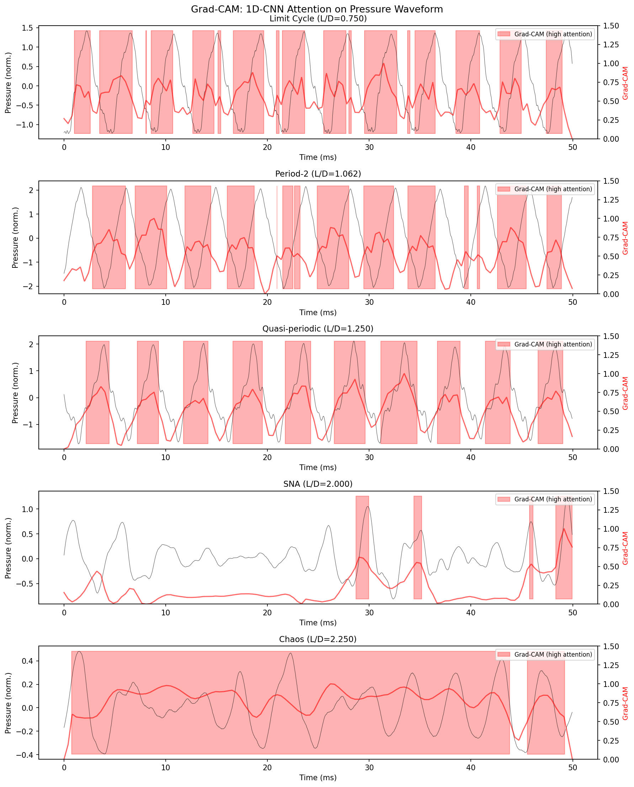

# ML Classification of Thermoacoustic Regimes in a Trapped Vortex Combustor

Thermoacoustic instabilities can crack liners, melt injectors, and destroy gas-turbine combustors in seconds. Being able to identify the current dynamical regime from a short pressure sample is a first step toward real-time monitoring and active control. This project classifies five such regimes in a lab-scale trapped vortex combustor (TVC) using classical ML, deep learning, and ensemble methods.

<p align="center">
  
  <br/>
  <em>Experimental setup representative: cavity-based combustor at IISc: Agarwal, et al., Mixing Enhancement in a Compact Trapped Vortex Combustor 2013.</em>
</p>

## Key Results

<p align="center">
  
</p>

- **3-class (Periodic / Quasi-periodic / Aperiodic):** **100% accuracy** with hard-voting ensemble across 7 models. Verified robust with classical models only.
- **5-class:** 69% $\pm$ 9.7% mean accuracy across 5 seeds for 2D-CNN on recurrence plots (best seed: 80%). 1D-CNN achieves 69% $\pm$ 4.9% (most stable DL model).
- **Cross-condition generalization:** Classifier trained at $\phi = 0.72$ achieves 100% on high-confidence recordings and 81% overall (3-class) when tested on new data at $\phi = 0.61$.
- **Novel finding:** Cross-channel coherence (spatial correlation of the acoustic mode across sensors) identified as the top regime discriminator. Not previously reported in thermoacoustics ML literature.

<p align="center">
  
  <br/>
  <em>Hard-voting ensemble: 20/20 correct on the 3-class problem.</em>
</p>

## The Five Regimes

As cavity length $L/D$ increases at fixed operating conditions, the TVC traverses a bifurcation sequence from periodic to chaotic dynamics:

| Regime | Description | Samples | 3-class |
|---|---|:-:|---|
| **Limit Cycle** | Single-frequency periodic oscillation | 5 | Periodic |
| **Period-2** | Period-doubled subharmonic | 3 | Periodic |
| **Quasi-periodic** | Two incommensurate frequencies, beat envelopes | 6 | Quasi-periodic |
| **SNA** (Strange Non-Chaotic Attractor) | Aperiodic but non-chaotic, zero Lyapunov exponent | 2 | Aperiodic |
| **Chaos** | Broadband, positive Lyapunov exponent | 4 | Aperiodic |

SNAs and Period-2 are the minority classes and sit at bifurcation boundaries, making them the hardest to classify.

## Dataset

- 20 pressure recordings from a lab-scale TVC at IIT Bombay
- 3 channels, 40000 samples per channel, 20 kHz sampling rate
- Cavity $L/D$ varied from 0.75 to 2.625 at fixed Re = 8000, $\phi = 0.72$
- Cross-condition test data: 15 recordings at $\phi = 0.61$

**Note:** Raw .mat data files are not included. Contact the Applied Flow Dynamics Laboratory, Dept. of Aerospace Engineering, IIT Bombay for data access.

## Repository Structure

```
src/                     Core modules (data loading, feature extraction)
pipelines/               Main ML scripts (classical, deep learning, ensembles)
analysis/
  nonlinear_dynamics/    RQA and prediction error analysis
  nld2_integration/      Adding NLD2 features to ML pipeline
  model_diagnostics/     Training curves, seed stability, per-class metrics
  cross_condition/       Generalization test at phi=0.61
notebooks/
  demo.ipynb             Quick demo (runs in <30 seconds, no data needed)
results/
  all_predictions.csv    Predictions from all 19 methods
  features.npz           Cached 93-feature matrix for 20 recordings
  key_figures/           Selected result figures
```

## Quick Start

### Prerequisites

```bash
pip install -r requirements.txt
```

### Demo (no data files needed)

```bash
jupyter notebook notebooks/demo.ipynb
```

The demo loads cached results and walks through the key findings interactively. Runtime: under 30 seconds.

### Full Pipeline (requires .mat data files)

```bash
# Place .mat files in data/
cd pipelines
python main_classical_ml.py --real-data --data-dir=../data --results-dir=../results
python main_deep_learning.py --real-data --data-dir=../data --results-dir=../results
python main_ensembles.py --real-data --data-dir=../data --results-dir=../results
```

### Analysis Scripts

```bash
# Nonlinear dynamics analysis
cd analysis/nonlinear_dynamics && python main_analysis.py

# Model diagnostics (training curves, seed stability)
cd analysis/model_diagnostics && python step1_cheap_diagnostics.py
cd analysis/model_diagnostics && python step2_training_diagnostics.py

# Cross-condition generalization test
cd analysis/cross_condition && python main_cross_condition_test.py
```

## Methods

### Feature Extraction

- **66 windowed features:** 50 ms windows with 50% overlap. Per-channel (RMS, spectral entropy, dominant frequency, kurtosis, sample entropy, autocorrelation decay, peak variability) and cross-channel (coherence, phase, correlation). Aggregated as mean and std across windows.
- **27 nonlinear features:** From full 2-second recordings. 0-1 chaos test K-value, Poincare return map descriptors, autocorrelation metrics.

### Models

- **Classical ML:** SVM (RBF), Random Forest, XGBoost on three feature sets (windowed, nonlinear, combined)
- **Deep Learning:** 1D-CNN on raw pressure, LSTM and GRU on feature sequences, 2D-CNN on recurrence plots. All architectures under 50K parameters with heavy regularization.
- **Ensembles:** Hard vote, soft vote (all, classical-only, deep-only), best hybrid, stacking with logistic regression meta-learner

<p align="center">
  
  <br/>
  <em>Grad-CAM attention maps for the 1D-CNN: the model independently learns to focus on peak amplitudes for limit cycles, alternating peaks for Period-2, beat envelopes for quasi-periodic, and sparse intermittent events for SNA.</em>
</p>

### Validation

Leave-one-L/D-out cross-validation (20 folds). Each fold holds out all windows from one recording. Zero window leakage between train and test.

## Reproducibility

- Random seed: 42 (set for numpy, torch, and all sklearn estimators)
- Deep learning seed stability tested across seeds {42, 7, 13, 100, 2024}
- Feature extraction is deterministic given the same input data
- Full pipeline runtime: ~30 minutes on CPU

## Contributors

- Amogh Kulkarni
- Souparna Bhowmik

## Citation

If you use this code, please cite:

```
@misc{kulkarni2026tvc,
  author = {Kulkarni, Amogh and Bhowmik, Souparna},
  title  = {ML Classification of Thermoacoustic Regimes in a TVC},
  year   = {2026},
  school = {IIT Bombay, Dept. of Aerospace Engineering}
}
```

## Acknowledgments

- PI: Prof. Vineeth Nair, Applied Flow Dynamics Laboratory, IIT Bombay
- Experimental data: Ashutosh Narayan Singh (Singh and Nair, SoTiC 2023; ASME GT2024-128504)
- Course: EE 769 Introduction to Machine Learning, Spring 2026
